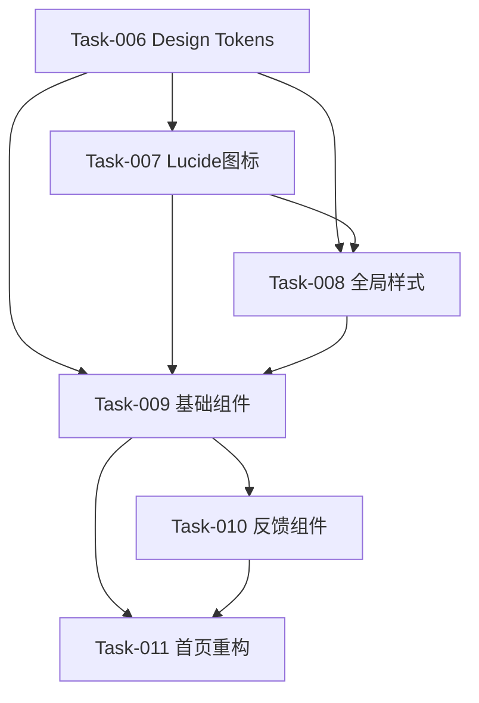

# Phase 2 任务指令 - 设计系统重建

> **生成角色**: 产品经理 (PM)  
> **生成日期**: 2026-05-03  
> **前置条件**: Phase 1审查通过  
> **执行角色**: frontend-developer  
> **预计工期**: 14天

---

## 📋 任务概览

| 任务ID | 任务名称 | 优先级 | 复杂度 | 依赖关系 | 预计工期 |
|--------|---------|--------|--------|---------|---------|
| Task-006 | Design Tokens实现 | P0 | 中 | 无 | 2天 |
| Task-007 | Lucide图标库集成 | P0 | 低 | Task-006 | 1天 |
| Task-008 | 全局样式升级 | P0 | 高 | Task-006, 007 | 3天 |
| Task-009 | 基础组件开发 | P1 | 高 | Task-006, 007, 008 | 4天 |
| Task-010 | 反馈组件开发 | P1 | 高 | Task-009 | 3天 |
| Task-011 | 首页视觉重构 | P1 | 中 | Task-009, 010 | 2天 |

**总工期**: 14天（可并行执行Task-007与Task-008的部分工作）

---

## 🔧 任务执行顺序

```
Task-006 (Design Tokens)
    ↓
Task-007 (Lucide图标) → Task-008 (全局样式)
    ↓                      ↓
Task-009 (基础组件) ←──────┘
    ↓
Task-010 (反馈组件)
    ↓
Task-011 (首页重构)
```

---

## 🎯 详细任务指令

### Task-006: Design Tokens CSS实现

**任务信息**：
- **任务ID**: Task-006
- **优先级**: P0
- **复杂度**: 中
- **负责人**: frontend-developer
- **预计工期**: 2天

**输入文档**：
- `docs/02-设计与规范/V3.0_设计规范文档.md`（第二章 Design Tokens）
- `tailwind.config.js`（当前配置）

**输出要求**：
1. `src/styles/tokens.css` - Design Tokens CSS变量定义
2. 更新的`tailwind.config.js` - Tailwind配置扩展

**验收标准**：
- ✅ 完整实现色彩系统（品牌色/功能色/中性色，15+个变量）
- ✅ 完整实现字体系统（6个层级，15+个变量）
- ✅ 完整实现间距系统（7个层级）
- ✅ 完整实现圆角系统（4个层级）
- ✅ 完整实现阴影系统（4个层级）
- ✅ 完整实现动画系统（3个时间+4个缓动）

**任务指令**：
```
请实现Design Tokens CSS文件：

1. 创建src/styles/tokens.css：
   - 定义:root CSS变量
   - 色彩系统：
     * 品牌色：--color-primary, --color-primary-hover, --color-primary-active
     * 功能色：--color-success, --color-warning, --color-error, --color-info
     * 中性色：--color-text-primary, --color-text-secondary, --color-bg, --color-border
   - 字体系统：
     * 标题：--font-size-h1 (24px), --font-size-h2 (20px), --font-size-h3 (18px), --font-size-h4 (16px)
     * 正文：--font-size-body1 (14px), --font-size-body2 (13px), --font-size-small (12px)
     * 行高：--line-height-tight (1.25), --line-height-normal (1.5), --line-height-loose (1.75)
   - 间距系统：
     * --spacing-xs (4px), --spacing-sm (8px), --spacing-md (16px), --spacing-lg (24px)
     * --spacing-xl (32px), --spacing-2xl (48px), --spacing-3xl (64px)
   - 圆角系统：
     * --radius-sm (2px), --radius-md (4px), --radius-lg (8px), --radius-xl (12px)
   - 阴影系统：
     * --shadow-sm, --shadow-md, --shadow-lg, --shadow-xl
   - 动画系统：
     * --duration-fast (150ms), --duration-normal (250ms), --duration-slow (350ms)
     * --ease-in, --ease-out, --ease-in-out, --ease-linear

2. 更新tailwind.config.js：
   - 扩展colors配置，引用CSS变量
   - 扩展fontSize配置
   - 扩展spacing配置
   - 扩展borderRadius配置
   - 扩展boxShadow配置
   - 扩展transitionDuration配置

3. 在src/main.tsx中引入tokens.css（已在Phase 1完成）

注意事项：
- 所有CSS变量使用:root作用域
- 颜色值使用V3.0设计规范中的藏青色系（#1E3A5F等）
- 圆角系统使用4px为基础（去AI化，避免大圆角）
- 阴影系统默认无阴影，hover时添加
```

---

### Task-007: Lucide图标库集成

**任务信息**：
- **任务ID**: Task-007
- **优先级**: P0
- **复杂度**: 低
- **负责人**: frontend-developer
- **预计工期**: 1天

**输入文档**：
- `docs/02-设计与规范/V3.0_设计规范文档.md`（5.4节 图标替换清单）
- `package.json`

**输出要求**：
1. 安装`lucide-react`依赖
2. `src/assets/icons/icon-mapping.md` - 图标替换映射表

**验收标准**：
- ✅ lucide-react安装成功
- ✅ 创建图标映射文档
- ✅ 所有Emoji有对应的Lucide图标
- ✅ Tree-shaking配置正确

**任务指令**：
```
请集成Lucide图标库：

1. 安装依赖：
   - npm install lucide-react

2. 创建图标映射文档（src/assets/icons/icon-mapping.md）：
   - 列出所有当前使用的Emoji
   - 为每个Emoji找到对应的Lucide图标
   - 映射示例：
     * 🛒 → ShoppingCart
     * 📝 → FileEdit
     * 📊 → BarChart3
     * ⚙️ → Settings
     * 🔍 → Search
     * 📁 → FolderOpen
     * 📦 → Package
     * 🏷️ → Tag
     * ✅ → CheckCircle
     * ❌ → XCircle

3. 配置Tree-shaking：
   - 确保vite.config.js支持Tree-shaking
   - 验证构建产物中只包含使用的图标
   - 使用命名导入：import { ShoppingCart } from 'lucide-react'

4. 输出映射文档供Task-008/009/010/011使用
```

---

### Task-008: 全局样式升级到Design Tokens

**任务信息**：
- **任务ID**: Task-008
- **优先级**: P0
- **复杂度**: 高
- **负责人**: frontend-developer
- **预计工期**: 3天

**输入文档**：
- `src/index.css`（当前样式）
- `src/styles/tokens.css`（Task-006产出）
- `docs/02-设计与规范/V3.0_设计规范文档.md`

**输出要求**：
1. 更新后的`src/index.css`
2. `src/styles/global.css` - 全局样式
3. `src/styles/utilities.css` - 工具类

**验收标准**：
- ✅ 所有硬编码颜色替换为CSS变量
- ✅ 所有硬编码字号替换为CSS变量
- ✅ 所有硬编码间距替换为CSS变量
- ✅ 移除所有Emoji样式
- ✅ 添加全局重置样式
- ✅ 修复BUG-001：CSS @import顺序（移到@tailwind之前）

**任务指令**：
```
请升级全局样式系统：

1. 创建src/styles/global.css：
   - 全局重置：
     * *, *::before, *::after { box-sizing: border-box; margin: 0; padding: 0; }
   - 字体家族定义：
     * font-family: -apple-system, BlinkMacSystemFont, 'Segoe UI', 'Roboto', sans-serif
   - 全局链接样式：
     * a { color: var(--color-primary); text-decoration: none; }
     * a:hover { text-decoration: underline; }
   - 全局按钮基础样式：
     * button { cursor: pointer; border: none; background: none; }
   - 可访问性样式：
     * :focus-visible { outline: 2px solid var(--color-primary); outline-offset: 2px; }

2. 创建src/styles/utilities.css：
   - 工具类：
     * .text-center { text-align: center; }
     * .flex { display: flex; }
     * .grid { display: grid; }
     * .hidden { display: none; }
   - 响应式工具类：
     * .sm\\:flex { @media (min-width: 640px) { display: flex; } }
   - 可见性工具类：
     * .sr-only { position: absolute; width: 1px; height: 1px; ... }

3. 更新src/index.css：
   - 修复BUG-001：将@import移到@tailwind之前
   - 引入顺序：
     * @import './tokens.css';
     * @import './global.css';
     * @import './utilities.css';
     * @tailwind base;
     * @tailwind components;
     * @tailwind utilities;

4. 全局搜索替换（使用IDE全局替换）：
   - 搜索所有硬编码颜色（#1E3A5F, #4A90A4等），替换为var(--color-primary)等
   - 搜索所有硬编码尺寸（16px, 24px等），替换为var(--spacing-md)等
   - 搜索所有Emoji，标记待替换（具体替换在Task-009/010/011执行）

注意事项：
- @import必须在@tailwind之前（修复BUG-001）
- 保留必要的Tailwind指令
- 替换后验证页面渲染正常
```

---

### Task-009: 通用组件库开发-基础组件

**任务信息**：
- **任务ID**: Task-009
- **优先级**: P1
- **复杂度**: 高
- **负责人**: frontend-developer
- **预计工期**: 4天

**输入文档**：
- `docs/02-设计与规范/V3.0_设计规范文档.md`（第三章 组件规范）
- Design Tokens（Task-006产出）
- 图标映射表（Task-007产出）

**输出要求**：
1. `src/components/common/Button/` - 按钮组件
2. `src/components/common/Input/` - 输入框组件
3. `src/components/common/Card/` - 卡片组件
4. 每个组件包含：组件文件 + TypeScript类型 + 单元测试

**验收标准**：
- ✅ Button组件：4种变体（Primary/Secondary/Ghost/Danger）
- ✅ Button组件：3种尺寸（Large/Medium/Small）
- ✅ Button组件：5种状态（Default/Hover/Active/Disabled/Loading）
- ✅ Input组件：5种类型（Text/Number/Select/Textarea/Date）
- ✅ Input组件：完整状态（Default/Hover/Focus/Error/Disabled）
- ✅ Card组件：3种类型（Default/Hover/Active）
- ✅ 所有组件支持TypeScript
- ✅ 所有组件包含单元测试（覆盖率≥80%）

**任务指令**：
```
请开发通用组件库（基础组件）：

1. Button组件（src/components/common/Button/）：
   - 文件结构：
     * Button.tsx - 组件实现
     * Button.types.ts - TypeScript类型定义
     * Button.test.tsx - 单元测试
     * index.ts - 导出
   - 功能要求：
     * 支持variant属性：'primary' | 'secondary' | 'ghost' | 'danger'
     * 支持size属性：'large' | 'medium' | 'small'
     * 支持disabled/loading状态
     * 使用Design Tokens（var(--color-primary)等）
     * 支持onClick事件
     * 支持子组件（children）
     * Loading状态显示旋转图标（使用Lucide的Loader2）
   - 样式要求：
     * Default: 正常样式
     * Hover: 颜色加深（var(--color-primary-hover)）
     * Active: 按下效果
     * Disabled: 透明度50%，cursor: not-allowed
     * Loading: 显示Loader图标，禁用点击

2. Input组件（src/components/common/Input/）：
   - 文件结构：
     * Input.tsx
     * Input.types.ts
     * Input.test.tsx
     * index.ts
   - 功能要求：
     * 支持type属性：'text' | 'number' | 'select' | 'textarea' | 'date'
     * 支持label/error/helperText属性
     * 支持required标记（显示*号）
     * 支持实时验证（onBlur时触发）
     * 使用Design Tokens
     * 支持value/onChange（受控组件）
   - 样式要求：
     * Default: 边框var(--color-border)
     * Hover: 边框变深
     * Focus: 边框var(--color-primary) + focus-visible outline
     * Error: 边框var(--color-error) + 红色错误提示
     * Disabled: 背景var(--color-bg)，透明度50%

3. Card组件（src/components/common/Card/）：
   - 文件结构：
     * Card.tsx
     * Card.types.ts
     * Card.test.tsx
     * index.ts
   - 功能要求：
     * 支持hover效果（阴影提升）
     * 支持active状态
     * 支持header/body/footer结构（使用React slots）
     * 使用Design Tokens
     * 支持onClick（可选）
   - 样式要求：
     * Default: 边框var(--color-border)，圆角var(--radius-md)
     * Hover: 阴影var(--shadow-md)，边框变深
     * Active: 阴影var(--shadow-lg)

4. 所有组件导出index.ts：
   - src/components/common/index.ts统一导出所有组件

5. 单元测试要求：
   - Button: 测试variant/size/disabled/loading状态
   - Input: 测试type/error/focus/required状态
   - Card: 测试default/hover/active状态
   - 覆盖率≥80%

注意事项：
- 所有组件使用TypeScript
- 使用Design Tokens，禁止硬编码颜色/尺寸
- 使用Lucide图标（禁止Emoji）
- 组件命名使用PascalCase
- 文件结构保持一致
```

---

### Task-010: 通用组件库开发-反馈组件

**任务信息**：
- **任务ID**: Task-010
- **优先级**: P1
- **复杂度**: 高
- **负责人**: frontend-developer
- **预计工期**: 3天

**输入文档**：
- `docs/02-设计与规范/V3.0_设计规范文档.md`（3.4/3.5/3.6节）
- Design Tokens
- 基础组件（Task-009产出）

**输出要求**：
1. `src/components/common/Modal/` - 模态框组件
2. `src/components/common/Toast/` - 提示组件
3. `src/components/common/Skeleton/` - 骨架屏组件
4. `src/components/common/Toast/ToastProvider.tsx` - 全局Toast管理

**验收标准**：
- ✅ Modal组件：4种尺寸（Small/Medium/Large/Full）
- ✅ Modal组件：完整结构（Header/Body/Footer）
- ✅ Modal组件：进入/退出动画
- ✅ Toast组件：4种类型（Success/Warning/Error/Info）
- ✅ Toast组件：自动消失（Error除外）
- ✅ Toast组件：最多显示3个
- ✅ Skeleton组件：3种类型（Text/Circle/Rect）
- ✅ Skeleton组件：渐变闪烁动画
- ✅ 所有组件包含单元测试（覆盖率≥80%）

**任务指令**：
```
请开发通用组件库（反馈组件）：

1. Modal组件（src/components/common/Modal/）：
   - 文件结构：
     * Modal.tsx
     * Modal.types.ts
     * Modal.test.tsx
     * index.ts
   - 功能要求：
     * 支持size属性：'small' | 'medium' | 'large' | 'full'
     * 支持title/closeButton属性
     * 支持onClose事件
     * 支持点击遮罩关闭
     * 支持ESC键关闭
     * 进入/退出动画（fade-in + scale-in）
     * 使用Design Tokens
   - 样式要求：
     * 遮罩：半透明黑色背景
     * 内容区：白色背景，圆角var(--radius-lg)
     * Header: 标题 + 关闭按钮（右上角）
     * Body: 内容区，padding var(--spacing-lg)
     * Footer: 操作按钮区（右对齐）
     * 动画：duration var(--duration-normal), ease-in-out

2. Toast组件（src/components/common/Toast/）：
   - 文件结构：
     * Toast.tsx
     * Toast.types.ts
     * Toast.test.tsx
     * ToastProvider.tsx - 全局管理
     * useToast.ts - Hook
     * index.ts
   - 功能要求：
     * 支持type属性：'success' | 'warning' | 'error' | 'info'
     * 支持message/description属性
     * 支持自动消失：
       - success: 2秒
       - warning: 3秒
       - info: 3秒
       - error: 手动关闭（不自动消失）
     * 支持最多显示3个（超过则队列等待）
     * 进入/退出动画（slide-in/slide-out）
     * 桌面端：右上角
     * 移动端：顶部居中
   - 样式要求：
     * Success: 绿色背景var(--color-success)
     * Warning: 橙色背景var(--color-warning)
     * Error: 红色背景var(--color-error)
     * Info: 蓝色背景var(--color-secondary)
     * 图标：使用Lucide（CheckCircle/AlertTriangle/XCircle/Info）

3. Skeleton组件（src/components/common/Skeleton/）：
   - 文件结构：
     * Skeleton.tsx
     * Skeleton.types.ts
     * Skeleton.test.tsx
     * index.ts
   - 功能要求：
     * 支持type属性：'text' | 'circle' | 'rect'
     * 支持自定义尺寸（width/height）
     * 渐变闪烁动画（1.5s循环）
     * 使用Design Tokens
   - 样式要求：
     * 背景：线性渐变（var(--color-bg) → var(--color-border) → var(--color-bg)）
     * 动画：background-position移动，1.5s循环
     * Text: 圆角var(--radius-sm)，高度var(--spacing-md)
     * Circle: 圆角50%，宽高相等
     * Rect: 圆角var(--radius-md)

4. ToastProvider集成：
   - 在src/main.tsx中包裹应用
   - 与zustand store集成（useUIStore）
   - 提供useToast() Hook供组件调用

5. 单元测试要求：
   - Modal: 测试size/onClose/ESC键/点击遮罩关闭
   - Toast: 测试type/自动消失/最多显示3个
   - Skeleton: 测试type/自定义尺寸/动画
   - 覆盖率≥80%

注意事项：
- Modal需要Portal渲染（避免z-index问题）
- Toast需要使用Context API管理全局状态
- Skeleton动画使用CSS @keyframes
- 所有动画使用Design Tokens中的duration和easing
```

---

### Task-011: 首页视觉重构

**任务信息**：
- **任务ID**: Task-011
- **优先级**: P1
- **复杂度**: 中
- **负责人**: frontend-developer
- **预计工期**: 2天

**输入文档**：
- `src/pages/desktop/HomePage.jsx`（当前首页）
- `docs/02-设计与规范/V3.0_设计规范文档.md`（6.1节 首页设计）
- 通用组件库（Task-009/010产出）

**输出要求**：
1. `src/pages/desktop/HomePage.tsx` - 重构后的首页（TypeScript）
2. Before/After对比截图

**验收标准**：
- ✅ 移除所有Emoji（使用Lucide图标）
- ✅ 移除渐变背景（改为纯色#F0F4F8）
- ✅ 使用新的Button/Card组件
- ✅ 使用Design Tokens
- ✅ 功能卡片2x2 Grid布局
- ✅ 响应式适配（移动端单列）
- ✅ 视觉一致性评分≥95%

**任务指令**：
```
请重构首页视觉设计：

1. 创建src/pages/desktop/HomePage.tsx（使用TypeScript重写）：
   - 页面结构：
     * Header区：Logo + 标题（淘仓助手 V3.0）+ 副标题
     * 功能区：4个功能卡片（2x2 Grid）
     * Footer区：版权信息

2. 功能卡片设计（使用Card组件）：
   - 卡片1：制定采购方案
     * 图标：Lucide FileEdit（替代📝）
     * 标题：制定采购方案
     * 描述：AI智能生成采购方案
     * 按钮：开始制定（Button variant=primary）
   - 卡片2：政策文库
     * 图标：Lucide FolderOpen（替代📁）
     * 标题：政策文库
     * 描述：海量政策文件检索
     * 按钮：浏览文库（Button variant=secondary）
   - 卡片3：商品库
     * 图标：Lucide Package（替代📦）
     * 标题：商品库
     * 描述：丰富商品数据管理
     * 按钮：查看商品（Button variant=secondary）
   - 卡片4：合规测算
     * 图标：Lucide Calculator（替代📊）
     * 标题：合规测算
     * 描述：智能合规性测算
     * 按钮：开始测算（Button variant=secondary）

3. 样式要求：
   - 背景：var(--color-bg)（#F0F4F8）
   - 标题：var(--font-size-h1)，var(--color-text-primary)
   - 副标题：var(--font-size-body1)，var(--color-text-secondary)
   - Grid布局：
     * 桌面端：grid-cols-2 gap-lg
     * 移动端：grid-cols-1
   - Card间距：var(--spacing-lg)
   - 按钮间距：var(--spacing-md)

4. 响应式适配：
   - PC端（>1024px）：2x2 Grid，最大宽度1200px居中
   - 平板端（768px-1024px）：2x2 Grid，边距var(--spacing-lg)
   - 移动端（<768px）：单列，边距var(--spacing-md)

5. 移除的内容：
   - ❌ 所有Emoji图标
   - ❌ 渐变背景（bg-gradient-to-r等）
   - ❌ 大圆角（rounded-2xl改为rounded-md）
   - ❌ 重阴影（shadow-lg改为默认无阴影，hover添加）

6. 输出对比截图：
   - Before: 旧版首页截图
   - After: 新版首页截图
   - 标注主要变化点

注意事项：
- 使用TypeScript，定义Props类型
- 所有样式使用Design Tokens
- 所有图标使用Lucide
- 所有按钮/卡片使用通用组件
- 保持功能逻辑不变，仅视觉重构
```

---

## 📊 任务依赖关系图



---

## ✅ 验收检查清单

### 代码质量
- [ ] 所有组件使用TypeScript
- [ ] 所有样式使用Design Tokens（无硬编码）
- [ ] 所有图标使用Lucide（无Emoji）
- [ ] 组件命名使用PascalCase
- [ ] 文件结构统一规范

### 测试覆盖
- [ ] Button组件测试覆盖率≥80%
- [ ] Input组件测试覆盖率≥80%
- [ ] Card组件测试覆盖率≥80%
- [ ] Modal组件测试覆盖率≥80%
- [ ] Toast组件测试覆盖率≥80%
- [ ] Skeleton组件测试覆盖率≥80%

### 视觉一致性
- [ ] 色彩系统100%使用Design Tokens
- [ ] 字体系统100%使用Design Tokens
- [ ] 间距系统100%使用Design Tokens
- [ ] 圆角系统100%使用Design Tokens
- [ ] 首页视觉一致性评分≥95%

### Bug修复
- [ ] BUG-001: CSS @import顺序已修复
- [ ] BUG-002: 空chunk问题标记（Phase 5修复）

---

## 📝 交付物清单

1. `src/styles/tokens.css` - Design Tokens
2. `tailwind.config.js` - 更新的配置
3. `src/assets/icons/icon-mapping.md` - 图标映射表
4. `src/styles/global.css` - 全局样式
5. `src/styles/utilities.css` - 工具类
6. `src/components/common/Button/` - 按钮组件
7. `src/components/common/Input/` - 输入框组件
8. `src/components/common/Card/` - 卡片组件
9. `src/components/common/Modal/` - 模态框组件
10. `src/components/common/Toast/` - 提示组件
11. `src/components/common/Skeleton/` - 骨架屏组件
12. `src/pages/desktop/HomePage.tsx` - 重构后的首页
13. 单元测试文件（*.test.tsx）
14. Before/After对比截图

---

## 🔄 流转规则

**Phase 2完成后**：
1. frontend-developer输出完成提示
2. 用户转发给PM审查
3. PM进行质量审查（对照本指令的验收标准）
4. 审查通过 → 流转至Phase 3
5. 审查不通过 → 打回重做

---

**任务指令生成时间**: 2026-05-03  
**生成角色**: 产品经理 (PM)  
**依据规范**: product-manager.json 规则16/17（任务分解/指令生成）
